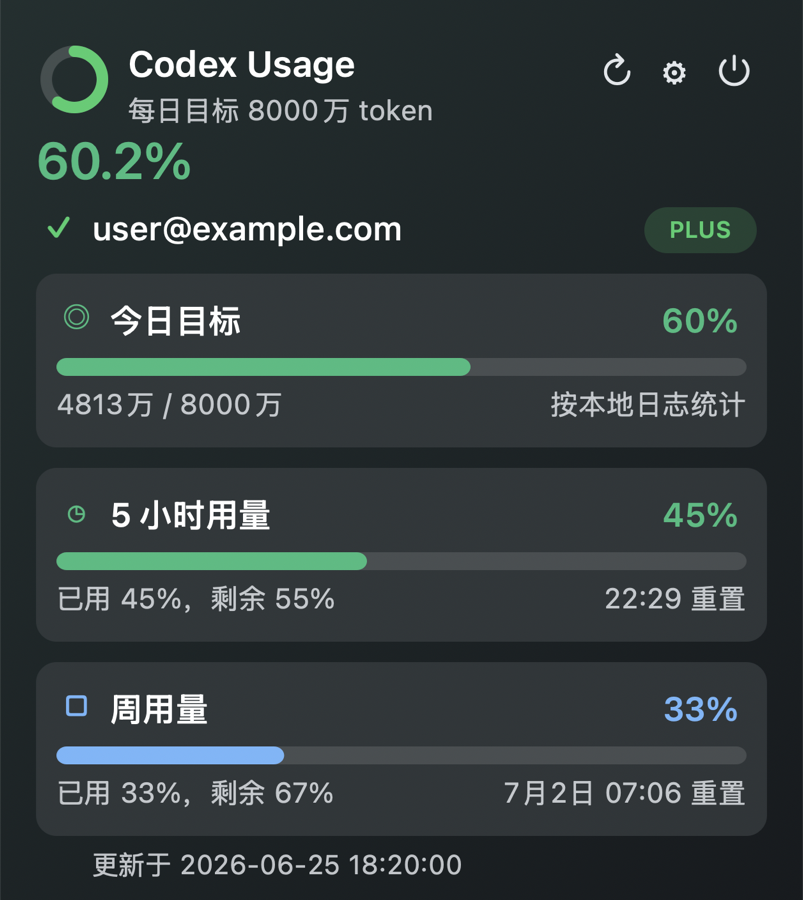

# CodexUsage

Language: **English** | [中文](README.zh-CN.md)

CodexUsage is a lightweight macOS menu bar app for monitoring local Codex token usage.



## Features

- Menu bar progress ring for daily token goal progress.
- Popover dashboard for:
  - daily usage against a configurable goal,
  - currently available Codex quota windows,
  - local account plan display.
- Daily usage includes a without-cache estimate alongside the goal progress.
- Warning colors when quota remaining falls to 20% or less.
- Local refresh button for rescanning Codex usage logs.
- Settings window for changing the daily token goal.
- In-app update checking from GitHub Releases.
- Small local-only app bundle with no server component.

## Data Source

CodexUsage reads local Codex files only, resolved from the current macOS user's home directory:

- Usage and quota events: `$HOME/.codex/sessions/**/*.jsonl`
- Account metadata: `$HOME/.codex/auth.json`

Daily token usage is calculated by summing `last_token_usage.total_tokens` from local `token_count` events. Quota percentages come from the currently available `rate_limits` windows written by Codex into those local events.

The app does not hardcode account IDs, usernames, or absolute paths. On each Mac, it uses that user's local Codex data path.

No usage data is uploaded by this app.

## Installation

Download `CodexUsage.dmg` from the release page.

1. Open `CodexUsage.dmg`.
2. Drag `CodexUsage.app` into `Applications`.
3. Open `CodexUsage.app` from Applications.
4. The app appears in the macOS menu bar.

If macOS says the developer cannot be verified, try opening the app once, then go to **System Settings** > **Privacy & Security** and click **Open Anyway** for `CodexUsage.app`. Confirm **Open** when macOS asks again. This is expected for builds that are not signed and notarized with an Apple Developer ID.

On some macOS versions, right-clicking `CodexUsage.app` and choosing **Open** may also show the same confirmation dialog.

## Usage

- Click the menu bar icon to open the usage dashboard.
- Click the refresh icon to rescan local Codex logs.
- Click the settings icon to change the daily goal.
- The default daily goal is `80,000,000 tokens` (`8000万 token`).

## Build From Source

Requirements:

- macOS 14 or newer
- Xcode command line tools
- Swift Package Manager

Build and run locally:

```bash
./script/build_and_run.sh
```

Create a local distributable app, ZIP, and DMG:

```bash
./script/package_app.sh
```

Artifacts are written to `dist/`.

## Distribution

The default packaging script creates an ad-hoc signed app suitable for local testing or personal use.

For a public release without Gatekeeper warnings, use a Developer ID certificate and Apple notarization:

```bash
SIGN_IDENTITY="Developer ID Application: Your Name (TEAMID)" \
NOTARY_PROFILE="codexusage-notary" \
./script/package_app.sh
```

## Compatibility

The package currently targets macOS 14 and newer.
